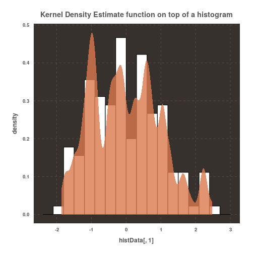
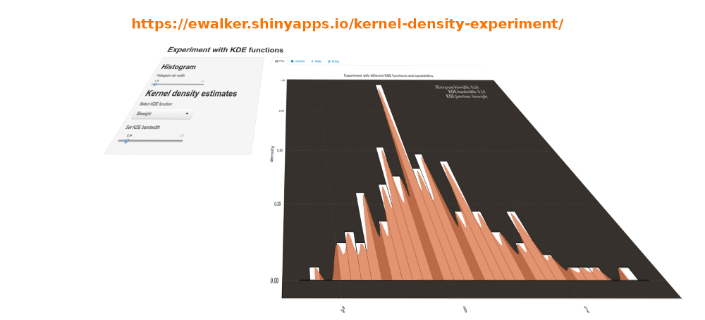

## Kernel Density Estimates

- Kernel Density Estimates are a relative new technique to estimate the probability density function of a random variable
- A KDE is formed by placing a smooth, peaked function at the position of each data point
- Contributions from all smoothed points are added up to form the curve
- Typical smoothing functions are  Gaussian and Epanechinikov 
- The spread (overlapping between consecutive values) of the kernel function is controled by the bandwidth

--- .class #id 

## An example of kernel density plot 

Generated ggplot2 diagram from the iris data set

---

## About the KDE Experiment application

Intended to learn and investigate

- How histograms and KDE relate to same data
- How different KDE functions appear to fit
- How the KDE bandwidth effects on the appearance of the probability density estimate 
- Give an idea what binwidth of in the histgram and bandwidth "respect" the nature of data

The KDE expereriment allows you to upload your own data for visualization as well. 

--- 

## How to use it

- Available online at [https://ewalker.shinyapps.io/kernel-density-experiment/](https://ewalker.shinyapps.io/kernel-density-experiment/)
- Default (iris dataset) is pre-loaded on the main page to get started with experimenting
- Help tab gives more instructions
- To upload your own data see Help tab
- Uploaded data is automatically centered and scaled 
- Shiny applicatoin source code available at [https://github.com/lniskanen/kernel-density-experiment](https://github.com/lniskanen/kernel-density-experiment)

--- 

